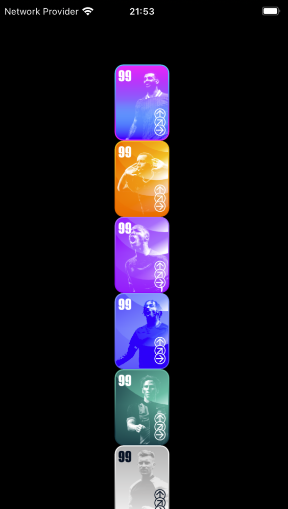
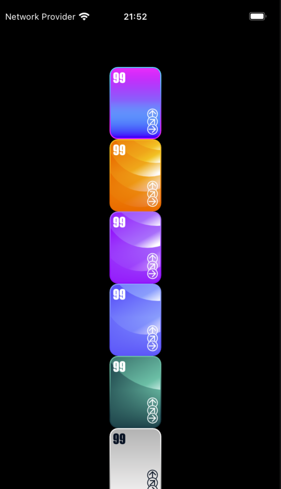

# flutter: flaky image minimal repo

## Get Started
- Repo uses `asdf` to manage Flutter SDK version
- Run `flutter pub get` to install dependencies
- Launch command to `Debug` in vscode has been added

## Reproduction
- The card should display player images from `assets/animation`
- However, no images are displayed
- Comment out `flutter_soloud` dependency in `pubspec.yaml`
- Rerun `flutter pub get`
- Restart the app
- Verify that the images are now displayed correctly

## Screenshots

Images should display

Images do not display
